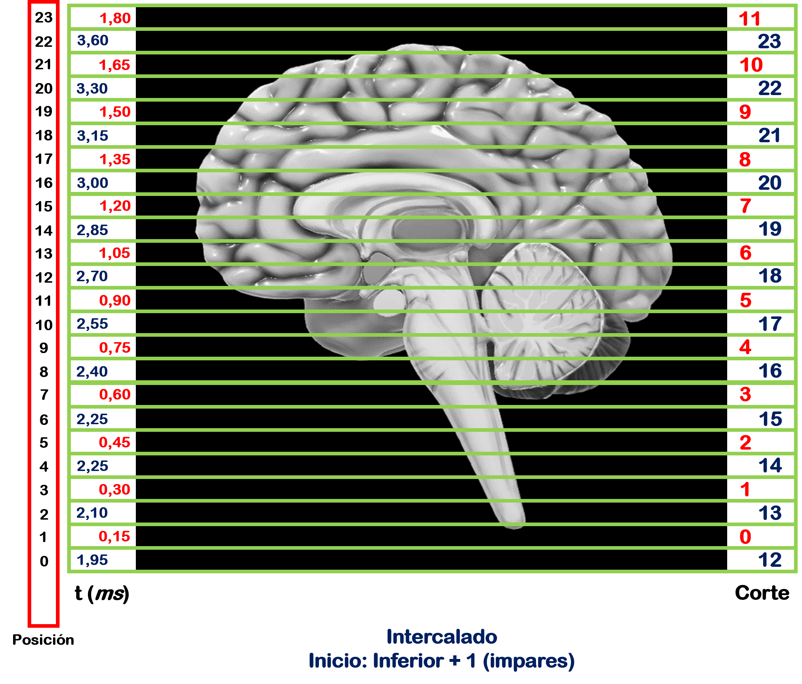

---

---

***Andres Eduardo Aracena Rangel***

*Estudiante del programa del Magister en Física Médica*

---

---

El siguiente Script de Python forma parte del trabajo especial de grado.

Profesora Guía:

*PhD María Daniela Cornejo*

---

---

Imagenes de fMRI extraidas de OpenNeuro:

- [ds001454](https://openneuro.org/datasets/ds001454/versions/1.3.1)
- [ds002422](https://openneuro.org/datasets/ds002422/versions/1.1.0)
- [ds004101](https://openneuro.org/datasets/ds004101/versions/1.0.1)

---

---

&nbsp;
Con referencia:

- [Pagina oficial Nibabel](https://nipy.org/nibabel/index.html) 
- [Pagina oficial JSON](https://www.json.org/)

Adquisisción de cortes:

- Poldrack, R. A., Mumford, J. A., and Nichols, T. E. (2011). Handbook of functional MRI data analysis. Cambridge University Press.

---

---

Imágenes realizadas por el autor del script, con apoyo de imagen 3D de corte sagital del cerebro del programa Microsoft PowerPoint.

---

---


 # Ejecución de la  función 'order_slice' para diversas imágenes

## Importamos librerias


```python
import time # medir el tiempo de ejecución de nuestros programas
start = time.process_time()
inicio = time.time()
```


```python
import os # Módulo que permite acceder a funcionalidades dependientes del Sistema Operativo
from os.path import join as opj # Método que concatena varios componentes de ruta con exactamente un separador de directorio(‘/’)

from IPython.display import Image, display #IPython proporciona una rica arquitectura para la computación interactiva

import pandas as pd # librería especializada en el manejo y análisis de estructuras de datos.
import json # Módulo para trabajar con datos JSON
```

## Definimos Parametros 


```python
'''
Ruta del directorio de la data
'''
path_data = '/home/aracena/data/'

'''
Ruta donde reposa los archivos '.json' de la imagen funcional de los diferentes estudios
'''
# Estudio ds001454
path_json_1 = opj(path_data,'ds001454','sub-01','ses-1','func')
json_arch_ds001454 = opj(path_json_1, 'sub-01_ses-1_task-rest_run-01_bold.json')

# Estudio ds002422
path_json_2 = opj(path_data,'ds002422','sub-01','func')
json_arch_ds002422 = opj(path_json_2, 'sub-01_task-rest_bold.json')

# Estudio ds004101
path_json_3 = opj(path_data,'ds004101','sub-09114','ses-1pre','func')
json_arch_ds004101 = opj(path_json_3,'sub-09114_ses-1pre_task-rest_bold.json')

'''
Ruta donde reposan las imagenes de referencia de orden de adquisición de imagenes
'''
path_expe = '/home/aracena/thesis_ds004101/00_fase0_tips_nibabel_funciones/'
path_ref = opj(path_expe, '00_00_archivo_json_and_func_ordenslice','00_00_ejecucion_funcion','imagenes')
```

## Función 'order_slice'


```python
'''
Funcion para extraer el orden de adquisión de los cortes de la imagen.

Inputs:

- json_arch: archivo '.json'

Output:

- slice_order: orden de adqusión de los cortes
- TR: tiempo de repetición
- number_of_slices: número de slices
- df_json: DF con la información del archivo '.json'
'''
 
def order_slice(json_arch):
    import json
    from IPython.display import Image, display
    import pandas as pd
    
    '''
    Cargamos el archivo '.json'
    '''
    with open(json_arch, 'rt') as fp:
        task_info = json.load(fp)
    
    '''
    Creamos una lista de las imágenes de referencia de adquisición de cortes
    '''
    lista_imagenes = [opj(path_ref,'SECUENCIAL_ASCENDENTE.png'),
                      opj(path_ref,'SECUENCIAL_DESCENDENTE.png'),
                      opj(path_ref,'INTERCALADO_PAR.png'),
                      opj(path_ref,'INTERCALADO_IMPAR.png')]

    '''
    Extraemos información del arhivo .json
    '''
    # tiempo de repeticion
    TR = task_info['RepetitionTime']
    # tiempo de adquisión de cortes
    slice_timing = task_info['SliceTiming']

    '''
    Procesamos data extraida del archivo .json
    '''
    # Número de slices
    number_of_slices = len(slice_timing)
    # Tiempo en adquirir primer corte
    time_first = TR/number_of_slices
    # Valor mínimo de slice_timing
    mini = min(slice_timing)
    # Valor máximo de slice_timing
    maxi = max(slice_timing)
    # Primer valor de slice_timing
    prim = slice_timing[0]
    # Segundo valor de slice_timing
    segu = slice_timing[1]

    if prim == mini:
        if segu == mini+time_first:
            print('Orden de adquisición de cortes secuenciales ascendente')
            slice_order = list(range(1, number_of_slices+1, 1))
            print(slice_timing)
            imagen_ref = lista_imagenes[3]
        else:
            print('Orden de adquisición de cortes intercalados inferior/pares')
            slice_order = list(range(1, number_of_slices+1, 2)) + list(range(2, number_of_slices+1, 2))
            print(slice_timing)
            imagen_ref = lista_imagenes[2]
    else:
        if segu == maxi - time_first:
            print('Orden de adquisición de cortes secuenciales descendente')
            slice_order = list(range(snumber_of_slices,0 , -1))
            print(slice_timing)
            imagen_ref = lista_imagenes[1]
        else:
            print('Orden de adquisición de cortes intercalados inferior+1/impares: \n')
            slice_order = list(range(2, number_of_slices+1, 2))+list(range(1, number_of_slices+1, 2))
            print(slice_timing)
            imagen_ref = lista_imagenes[3]
    
    '''
    Creamos un DataFrame (DF) con la información del archivo '.json'
    '''
    list_dic = list(task_info.keys())
    lista_json = []
    for i, js in enumerate(list_dic):
        # Como los valores de las claves la quiero visualizar en columnas, debo verificar que el
        # valor de la clave no sea una lista.
        tipo = type(task_info[js])
        if tipo == list:
            A = str(task_info[js])# convertimos en string
            val = ''.join(A)  # unimos elemenros de la lista, convirtiendo en 1 dimension
            lista_json.append(val)
        else:
            lista_json.append((task_info[js]))

    # Creamos DF del archivo '.json'
    df_json = pd.DataFrame(lista_json)
    df_json.columns = [('IRMf '+ lista_json[0])]
    df_json.index = [list_dic]
    
    return slice_order,TR, number_of_slices, df_json, imagen_ref
```

## Creamos diccionario con las imagenes 


```python
archivos_json = {'ds001454_funcional': json_arch_ds001454,
                 'ds002422_funcional': json_arch_ds002422, 
                 'ds004101_funcional': json_arch_ds004101}
```


```python
archivos_json['ds001454_funcional']
```


    '/home/aracena/data/ds001454/sub-01/ses-1/func/sub-01_ses-1_task-rest_run-01_bold.json'


## Ejecutamos función


```python
for i, imjs in enumerate(archivos_json):
    print('---------------------------------------------------------'+
          '--------------------------------------------------------\n')
    print('Imagen del estudio '+imjs)
    datos_json_img = order_slice(json_arch= archivos_json[imjs])
    print('\nTiempo de repetición (TR)= ', datos_json_img[1])
    print('\nNúmero de cortes = ', datos_json_img[2])
    display(Image(datos_json_img[4], width=400, height=400))
    display(datos_json_img[3])
```

    -----------------------------------------------------------------------------------------------------------------
    
    Imagen del estudio ds001454_funcional
    Orden de adquisición de cortes intercalados inferior+1/impares: 
    
    [1, 0, 1.055, 0.055, 1.11, 0.11, 1.165, 0.165, 1.22, 0.2225, 1.2775, 0.2775, 1.3325, 0.3325, 1.3875, 0.3875, 1.4425, 0.4425, 1.4975, 0.5, 1.555, 0.555, 1.61, 0.61, 1.665, 0.665, 1.72, 0.72, 1.7775, 0.7775, 1.8325, 0.8325, 1.8875, 0.8875, 1.9425, 0.9425]
    
    Tiempo de repetición (TR)=  2
    
    Número de cortes =  36


    

    


<div>
<style scoped>
    .dataframe tbody tr th:only-of-type {
        vertical-align: middle;
    }

    .dataframe tbody tr th {
        vertical-align: top;
    }

    .dataframe thead th {
        text-align: right;
    }
</style>
<table border="1" class="dataframe">
  <thead>
    <tr style="text-align: right;">
      <th></th>
      <th>IRMf Siemens</th>
    </tr>
  </thead>
  <tbody>
    <tr>
      <th>Manufacturer</th>
      <td>Siemens</td>
    </tr>
    <tr>
      <th>ManufacturersModelName</th>
      <td>Skyra</td>
    </tr>
    <tr>
      <th>EchoTrainLength</th>
      <td>32</td>
    </tr>
    <tr>
      <th>AcquisitionNumber</th>
      <td>1</td>
    </tr>
    <tr>
      <th>InstitutionName</th>
      <td>Princeton_University_-_Neuroscience_Institute</td>
    </tr>
    <tr>
      <th>InstitutionAddress</th>
      <td>Washington_and_Faculty_Rd._-_Building_25_25_Pr...</td>
    </tr>
    <tr>
      <th>DeviceSerialNumber</th>
      <td>45031</td>
    </tr>
    <tr>
      <th>SoftwareVersions</th>
      <td>syngo_MR_D11</td>
    </tr>
    <tr>
      <th>ProcedureStepDescription</th>
      <td>NormanLab_Anna</td>
    </tr>
    <tr>
      <th>ScanningSequence</th>
      <td>EP</td>
    </tr>
    <tr>
      <th>SequenceVariant</th>
      <td>SK</td>
    </tr>
    <tr>
      <th>SeriesDescription</th>
      <td>epi_195_3x3x3_2s</td>
    </tr>
    <tr>
      <th>BodyPartExamined</th>
      <td>HEAD</td>
    </tr>
    <tr>
      <th>ProtocolName</th>
      <td>epi_195_3x3x3_2s</td>
    </tr>
    <tr>
      <th>SequenceName</th>
      <td>_epfid2d1_64</td>
    </tr>
    <tr>
      <th>ImageType</th>
      <td>['ORIGINAL', 'PRIMARY', 'M', 'ND', 'NORM', 'MO...</td>
    </tr>
    <tr>
      <th>AcquisitionTime</th>
      <td>22:00:42.805000</td>
    </tr>
    <tr>
      <th>MagneticFieldStrength</th>
      <td>3</td>
    </tr>
    <tr>
      <th>FlipAngle</th>
      <td>71</td>
    </tr>
    <tr>
      <th>EchoTime</th>
      <td>0.03</td>
    </tr>
    <tr>
      <th>RepetitionTime</th>
      <td>2</td>
    </tr>
    <tr>
      <th>PhaseEncodingLines</th>
      <td>64</td>
    </tr>
    <tr>
      <th>BandwidthPerPixelPhaseEncode</th>
      <td>47.348</td>
    </tr>
    <tr>
      <th>EffectiveEchoSpacing</th>
      <td>0.00033</td>
    </tr>
    <tr>
      <th>TotalReadoutTime</th>
      <td>0.02046</td>
    </tr>
    <tr>
      <th>AccelFactPE</th>
      <td>2</td>
    </tr>
    <tr>
      <th>TrueEchoSpacing</th>
      <td>0.00066</td>
    </tr>
    <tr>
      <th>SliceTiming</th>
      <td>[1, 0, 1.055, 0.055, 1.11, 0.11, 1.165, 0.165,...</td>
    </tr>
    <tr>
      <th>PhaseEncodingDirection</th>
      <td>j-</td>
    </tr>
    <tr>
      <th>ConversionSoftware</th>
      <td>dcm2niix</td>
    </tr>
    <tr>
      <th>ConversionSoftwareVersion</th>
      <td>v1.0.20170724 (OpenJPEG build) GCC6.1.0</td>
    </tr>
  </tbody>
</table>
</div>


    -----------------------------------------------------------------------------------------------------------------
    
    Imagen del estudio ds002422_funcional
    Orden de adquisición de cortes intercalados inferior+1/impares: 
    
    [1.5375, 0, 1.6225, 0.085, 1.7075, 0.1725, 1.7925, 0.2575, 1.8775, 0.3425, 1.9625, 0.4275, 2.05, 0.5125, 2.135, 0.5975, 2.22, 0.6825, 2.305, 0.77, 2.39, 0.855, 2.475, 0.94, 2.56, 1.025, 2.6475, 1.11, 2.7325, 1.195, 2.8175, 1.28, 2.9025, 1.3675, 2.9875, 1.4525]
    
    Tiempo de repetición (TR)=  3.56
    
    Número de cortes =  36


    

    


<div>
<style scoped>
    .dataframe tbody tr th:only-of-type {
        vertical-align: middle;
    }

    .dataframe tbody tr th {
        vertical-align: top;
    }

    .dataframe thead th {
        text-align: right;
    }
</style>
<table border="1" class="dataframe">
  <thead>
    <tr style="text-align: right;">
      <th></th>
      <th>IRMf rest</th>
    </tr>
  </thead>
  <tbody>
    <tr>
      <th>TaskName</th>
      <td>rest</td>
    </tr>
    <tr>
      <th>MagneticFieldStrength</th>
      <td>1.5</td>
    </tr>
    <tr>
      <th>Manufacturer</th>
      <td>Siemens</td>
    </tr>
    <tr>
      <th>ManufacturersModelName</th>
      <td>Avanto</td>
    </tr>
    <tr>
      <th>BodyPartExamined</th>
      <td>HEAD</td>
    </tr>
    <tr>
      <th>PatientPosition</th>
      <td>HFS</td>
    </tr>
    <tr>
      <th>ProcedureStepDescription</th>
      <td>head_NEURO</td>
    </tr>
    <tr>
      <th>SoftwareVersions</th>
      <td>syngo_MR_B19</td>
    </tr>
    <tr>
      <th>MRAcquisitionType</th>
      <td>2D</td>
    </tr>
    <tr>
      <th>ScanningSequence</th>
      <td>EP</td>
    </tr>
    <tr>
      <th>SequenceVariant</th>
      <td>SK</td>
    </tr>
    <tr>
      <th>ScanOptions</th>
      <td>FS</td>
    </tr>
    <tr>
      <th>SequenceName</th>
      <td>_epfid2d1_64</td>
    </tr>
    <tr>
      <th>ImageType</th>
      <td>['ORIGINAL', 'PRIMARY', 'FMRI', 'NONE', 'ND', ...</td>
    </tr>
    <tr>
      <th>SliceThickness</th>
      <td>3.6</td>
    </tr>
    <tr>
      <th>SpacingBetweenSlices</th>
      <td>3.78</td>
    </tr>
    <tr>
      <th>EchoTime</th>
      <td>0.05</td>
    </tr>
    <tr>
      <th>RepetitionTime</th>
      <td>3.56</td>
    </tr>
    <tr>
      <th>FlipAngle</th>
      <td>90</td>
    </tr>
    <tr>
      <th>PartialFourier</th>
      <td>1</td>
    </tr>
    <tr>
      <th>BaseResolution</th>
      <td>64</td>
    </tr>
    <tr>
      <th>DelayTime</th>
      <td>0.5</td>
    </tr>
    <tr>
      <th>PhaseResolution</th>
      <td>1</td>
    </tr>
    <tr>
      <th>ReceiveCoilName</th>
      <td>HeadMatrix</td>
    </tr>
    <tr>
      <th>PulseSequenceDetails</th>
      <td>%SiemensSeq%_ep2d_bold</td>
    </tr>
    <tr>
      <th>PercentPhaseFOV</th>
      <td>100</td>
    </tr>
    <tr>
      <th>PhaseEncodingSteps</th>
      <td>64</td>
    </tr>
    <tr>
      <th>AcquisitionMatrixPE</th>
      <td>64</td>
    </tr>
    <tr>
      <th>ReconMatrixPE</th>
      <td>64</td>
    </tr>
    <tr>
      <th>BandwidthPerPixelPhaseEncode</th>
      <td>34.722</td>
    </tr>
    <tr>
      <th>EffectiveEchoSpacing</th>
      <td>0.00045</td>
    </tr>
    <tr>
      <th>DerivedVendorReportedEchoSpacing</th>
      <td>0.00045</td>
    </tr>
    <tr>
      <th>TotalReadoutTime</th>
      <td>0.02835</td>
    </tr>
    <tr>
      <th>PixelBandwidth</th>
      <td>2604</td>
    </tr>
    <tr>
      <th>DwellTime</th>
      <td>0.000003</td>
    </tr>
    <tr>
      <th>PhaseEncodingDirection</th>
      <td>j-</td>
    </tr>
    <tr>
      <th>SliceTiming</th>
      <td>[1.5375, 0, 1.6225, 0.085, 1.7075, 0.1725, 1.7...</td>
    </tr>
    <tr>
      <th>InPlanePhaseEncodingDirectionDICOM</th>
      <td>COL</td>
    </tr>
    <tr>
      <th>NumberOfVolumesDiscardedByUser</th>
      <td>3</td>
    </tr>
    <tr>
      <th>Instructions</th>
      <td>Participants were asked to close their eyes, t...</td>
    </tr>
  </tbody>
</table>
</div>


    -----------------------------------------------------------------------------------------------------------------
    
    Imagen del estudio ds004101_funcional
    Orden de adquisición de cortes intercalados inferior+1/impares: 
    
    [1.205, 0, 1.2725, 0.0675, 1.3375, 0.135, 1.405, 0.2, 1.4725, 0.2675, 1.54, 0.335, 1.605, 0.4025, 1.6725, 0.4675, 1.74, 0.535, 1.8075, 0.6025, 1.875, 0.67, 1.94, 0.7375, 2.0075, 0.8025, 2.075, 0.87, 2.1425, 0.9375, 2.2075, 1.005, 2.275, 1.07, 2.3425, 1.1375]
    
    Tiempo de repetición (TR)=  2.4
    
    Número de cortes =  36


    

    


<div>
<style scoped>
    .dataframe tbody tr th:only-of-type {
        vertical-align: middle;
    }

    .dataframe tbody tr th {
        vertical-align: top;
    }

    .dataframe thead th {
        text-align: right;
    }
</style>
<table border="1" class="dataframe">
  <thead>
    <tr style="text-align: right;">
      <th></th>
      <th>IRMf rest</th>
    </tr>
  </thead>
  <tbody>
    <tr>
      <th>TaskName</th>
      <td>rest</td>
    </tr>
    <tr>
      <th>MagneticFieldStrength</th>
      <td>3</td>
    </tr>
    <tr>
      <th>Manufacturer</th>
      <td>Siemens</td>
    </tr>
    <tr>
      <th>ManufacturersModelName</th>
      <td>Verio</td>
    </tr>
    <tr>
      <th>BodyPartExamined</th>
      <td>HEAD</td>
    </tr>
    <tr>
      <th>PatientPosition</th>
      <td>HFS</td>
    </tr>
    <tr>
      <th>MRAcquisitionType</th>
      <td>2D</td>
    </tr>
    <tr>
      <th>ScanningSequence</th>
      <td>EP</td>
    </tr>
    <tr>
      <th>SequenceVariant</th>
      <td>SK</td>
    </tr>
    <tr>
      <th>ScanOptions</th>
      <td>FS</td>
    </tr>
    <tr>
      <th>ImageType</th>
      <td>['ORIGINAL', 'PRIMARY', 'M', 'ND', 'MOSAIC']</td>
    </tr>
    <tr>
      <th>SliceThickness</th>
      <td>3</td>
    </tr>
    <tr>
      <th>SpacingBetweenSlices</th>
      <td>3.75</td>
    </tr>
    <tr>
      <th>EchoTime</th>
      <td>0.03</td>
    </tr>
    <tr>
      <th>RepetitionTime</th>
      <td>2.4</td>
    </tr>
    <tr>
      <th>FlipAngle</th>
      <td>90</td>
    </tr>
    <tr>
      <th>PercentPhaseFOV</th>
      <td>100</td>
    </tr>
    <tr>
      <th>PhaseEncodingSteps</th>
      <td>64</td>
    </tr>
    <tr>
      <th>AcquisitionMatrixPE</th>
      <td>64</td>
    </tr>
    <tr>
      <th>ReconMatrixPE</th>
      <td>64</td>
    </tr>
    <tr>
      <th>EffectiveEchoSpacing</th>
      <td>0.00051</td>
    </tr>
    <tr>
      <th>TotalReadoutTime</th>
      <td>0.03213</td>
    </tr>
    <tr>
      <th>PhaseEncodingDirection</th>
      <td>i</td>
    </tr>
    <tr>
      <th>SliceTiming</th>
      <td>[1.205, 0, 1.2725, 0.0675, 1.3375, 0.135, 1.40...</td>
    </tr>
    <tr>
      <th>InPlanePhaseEncodingDirectionDICOM</th>
      <td>ROW</td>
    </tr>
    <tr>
      <th>Instructions</th>
      <td>Lie still with eyes closed, don't keep yoursel...</td>
    </tr>
  </tbody>
</table>
</div>


## Tiempo de ejecución


```python
fin = time.time()
end = time.process_time()
tiempo = fin - inicio
tiempo2 = end - start

print('--------------------------------------')
print('tiempo de ejecución\n\n', round(tiempo,3), 'seg\n', round(tiempo/60,3), 'min')     
print('--------------------------------------')
print('tiempo de ejecución del sistema y CPU\n\n', round(tiempo2,3), 'seg\n', round(tiempo2/60,3), 'min')
print('--------------------------------------')
```

    --------------------------------------
    tiempo de ejecución
    
     0.957 seg
     0.016 min
    --------------------------------------
    tiempo de ejecución del sistema y CPU
    
     1.007 seg
     0.017 min
    --------------------------------------


## Fin
